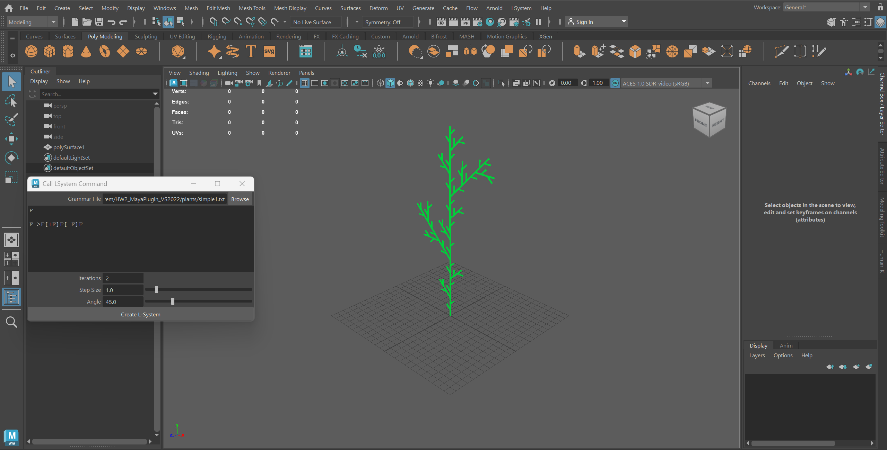
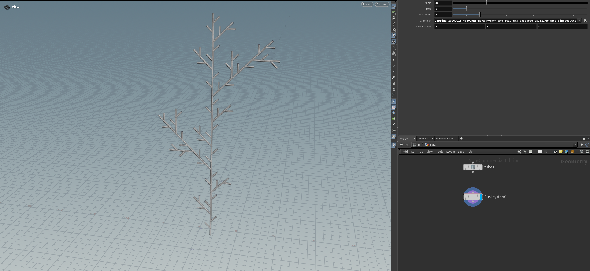

# CIS 6600 LSystem Plugins

This is a backup summary of the CIS 6600 plugin homework. All the four homeworks are using C++ to write plugins for either Maya or Houdini. Here are the demo and descriptions about the plugin.

[click for video demo](https://drive.google.com/file/d/1IHvBtbskf_MHM3fxHy0f_W6Y0Mc4TF2Z/view?usp=sharing)

## Homework 1

The homework 1 part is a practice to get familiar with Maya plugin. It contains the setup description for creating and connecting a Maya plugin, with a basic plugin that can create a Hello Maya window.

## Homework 2

The homework 2 part contains the plugin that implements the basic LSystem Maya plugin, and also a .MEL script that can create a GUI for the LSystem to import grammer file and set parameters to create LSystem structure.

## Homework 3

For homework 3, this part contains several different settings. First of all, instead of writing CPP and MEL scripts, this part sets the plugin in Python. It also allows different structures to be contained and determined within the LSystem generation (here we use * to represent flowers), so that they can be assigned with different polygons. Besides, this part implements a RandomNode that can choose a certain number of random points within the determined range, then create default polygons or copy existing objects to the points by using Maya Instancer Node.

## Homework 4

In this part, instead of doing LSystem in Maya, the code implements a Houdini LSystem Plugin. Although Houdini already contains a Houdini plugin, this is still a good practice about how we may create a Houdini plugin. About the implementation, it contains the UI to set the grammar file and parameters to generate the LSystem. For special modification, I have also allowed input geometry to as a source to form the branches of the LSystem.

---

PS: hw4 does not have .vs file directly included, not sure what will happen but be careful if reusing resources. All initial zipped files included, may try to use that if reusing in need.